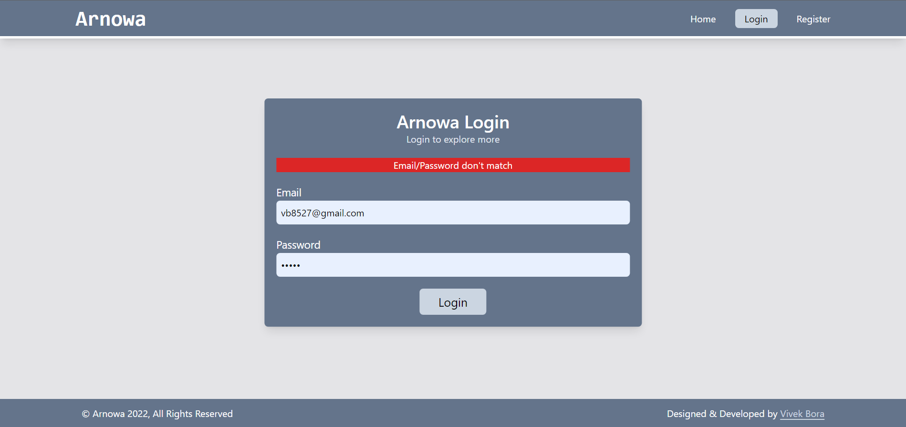
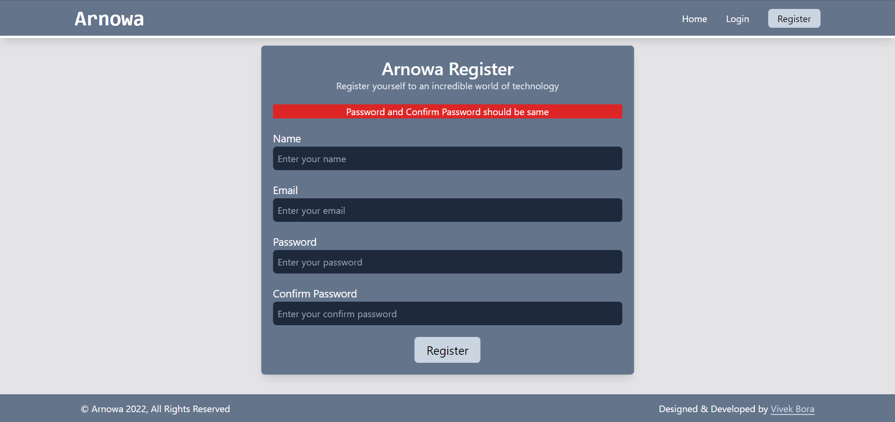

# Arnowa Selection Test by Vivek Bora

### Installation: Install Node Packages

```js
npm install
```

#### Packages Used:
- Express : For Framework Functionality
- EJS : For Template Engine
- EJS Layouts : For Implementing Layouts Functionality in EJS
- bcrypt : For Password Hashing and Verification
- connect-mongo : For Storing Sessions in DB
- connect-flash : For Implementing Flash Messages Functionality
- express-sessions: For enabling sessions in express
- mongoose : For Communicating with MongoDB Database
- passport & passport-local : To Implement Local Authentication System
- tailwindcss : Used for Styling the application


### Live Demo:

[Arnowa Selection Test Demo](https://arnowa-vivek.herokuapp.com/)

#### Demo Login Details : 
`Email:` `vb8527@gmail.com`
`Password:` `vivek`

### Run Project:

`npm start` 

If you have nodemon installed then run using, can be installed as `npm install -g nodemon`

`nodemon index.js`


### Screenshots
#### Register Page


#### Login page


#### Register Page


#### Dashboard


### Validation Screenshots
#### Login Errors : Email/Password don't match


#### Register Errors : Email/Password doesn't match


#### Register Errors : Password and Confirm Password should be same
